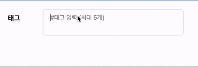

## 해시태그 기능

해시 태그 기능은 게시물을 구현할 때 거의 빠지지 않고 사용되는 기능이라고 할 수 있다. 태그를 구현하는 방법에는 여러가지가 있지만, 스페이스를 이용해 태그를 생성하고 백스페이스를 통해 삭제가 가능한 동적인 태그 생성 디자인이 가장 많이 사용된다고 할 수 있다. 티스토리, Velog등 에서 이와 같은 방식으로 해시 태그 기능을 제공하고 있다.

기능 구현을 위해 아래의 요구 사항을 만족하는 해시 태그 기능을 구현한다.
1. 원하는 태그 입력 후 스페이스바를 누르면 태그 생성
2. 태그를 눌렀을 때 & 입력이 없는 상태에서 Backspace를 눌렀을 때 태그 삭제
3. 드래그 앤 드롭으로 순서 변경

참고: [React에서 드래그 앤 드랍 직접 구현하기](https://ggarden.tistory.com/entry/react-drag-drop)

### 1. 태그 생성
`hashArr`상태를 생성해 `input`태그에서 `onKeyDown`이벤트가 발생했을 때 `value`값을 배열에 추가한다.
```
const addHashTag = () => {
    setHashArr((prev) => [...prev, hashTag])
}

<input
    onKeyDown={(e) => {
        if(e.code === "Space"){
            e.preventDefault();
            addHashTag()
        }
    }}
/>
```

만약 이미 생성된 태그라면 중복하지 않는 코드로 개선할 수 있다.
```
const addHashTag = () => {
    setHashArr((prev) => prev.include(hashTag) ? prev : [...prev, hashTag])
}
```

### 2. 태그 삭제
태그 삭제는 두 가지 방법으로 기능한다. 하나는 태그를 클릭 시 삭제되고, 하나는 입력이 없는 상태에서 백스페이스를 누르면 최근 추가한 태그가 삭제된다.

- 클릭 시 삭제는 `onClick`함수로 간단하게 구현 가능하다.
```
const deleteTagButton = (tag: string) => {
    setHashArr((prev) => prev.filter((t) => t !== tag))
}
...
{hashArr.map((tag, index) => {
    return(
        <div
            className="flex gap-3 my-1 mr-2 bg-red-100 text-red-500 rounded-xs px-1 cursor-pointer"
            key={index}
            onClick={() => deleteTagButton(tag)}
        >
            <p>#{tag}</p>
            <p>x</p>
        </div>
    )
})}
```

- 백스페이스 눌렀을 때 삭제는 `onKeyDown`함수를 사용해서 구현 가능하다.
조건은 `hashTag`가 없지 않거나 `hashArr`의 길이가 0이면 실행하지 않는다.
```
const deleteTagBackspace = () => {
    if(hashTag !== "" || hashArr.length === 0) return;
    setHashArr((prev) => prev.slice(0, -1));
}
...
<input
    onKeyDown={(e) => {
        if(e.key === "Backspace){
            deleteTagBackspace();
        }
    }}
/>
```

#### 2-1. 기능 통합
`onKeyDown`기능이 중복되므로 이를 `handleKeyDown`함수에 통합했다.
```
const handleKeyDown = (e: React.KeyboardEvent<HTMLInputElement>) => {
    if(e.nativeEvent.isComposing) return;

    if(e.code === "Space"){
        e.preventDefault();
        addHashTag()
    }

    if(e.key === "Backspace"){
        deleteTagBackspace()
    }
}
...
<input
    onKeyDown={handleKeyDown}
/>
```

### 3. 순서 변경
`draggable`, `onDragStart`, `onDragEnter`, `onDragEnd`, `onDragOver`속성을 사용한다.

- `draggable`: 드래그가 가능하도록 만든다.
- `onDragStart`: 해당 요소가 드래그를 시작할 때 동작(드래그 대상(바꾸고 싶은 요소)을 파악할 때)
- `onDragEnter`: 해당 요소가 드래그 진입할 때 동작(드랍 대상(바꾸고 싶은 위치 요소)을 파악할 때)
- `onDragEnd`: 드롭했을 때 동작
- `onDragOver`: 드롭존 위로 드래그 됐을때 적용

```
const dragItem = useRef<number | null>(null)
const dragOverItem = useRef<number | null>(null)

const dragStart = (idx: number) => {
    dragItem.current = idx
}

const dragEnter = (idx: number) => {
    dragOverItem.current = idx
}

const drop = () => {
    if (dragItem.current === null || dragOverItem.current === null) return

    const newList = [...list]
    const dragged = newList[dragItem.current]

    newList.splice(dragItem.current, 1)
    newList.splice(dragOverItem.current, 0, dragged)

    dragItem.current = null
    dragOverItem.current = null

    setList(newList)
}
...
{hashArr.map((tag, idx) => {
    return(
        <div
            key={idx}
            draggable
            onDragStart={() => dragStart(idx)}
            onDragEnter={() => dragEnter(idx)}
            onDragEnd={drop}
            onDragOver={(e) => e.preventDefault()}
        >
            <p>#{tag}</p>
            <p>x</p>
        </div>
    )
})}
```